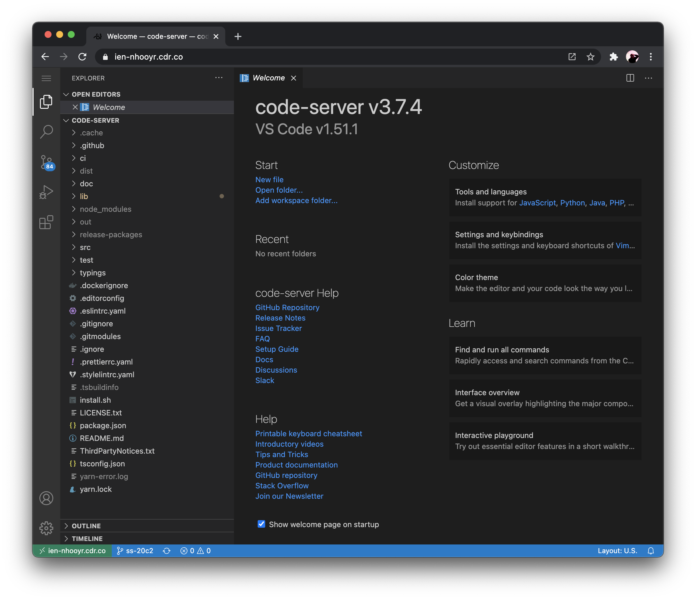

<!-- TOC GitLab -->

+ [安装包 各式各样](#安装包-各式各样)
+ [Archlinux 安装](#archlinux-安装)
  * [下载插件(`proot`,`git`,`bsdtar`)](#下载插件prootgitbsdtar)
  * [安装`TermuxArch`](#安装termuxarch)
  * [进入](#进入)
  * [`bash` 使用](#bash-使用)
  * [退出](#退出)
  * [修改源](#修改源)
  * [更新插件](#更新插件)
+ [安装 Ubuntu](#安装-ubuntu)
  * [获取 `sdcard`](#获取-sdcard)
  * [换源](#换源)
  * [安装安装包 `proot-distro`](#安装安装包-proot-distro)
  * [安装 Ubuntu](#安装-ubuntu-1)
  * [运行](#运行)
  * [修改为 ubuntu](#修改为-ubuntu)
+ [网页版 code-server](#网页版-code-server)
  * [安装](#安装)
  * [修改密码](#修改密码)
+ [vscodevscode Extensions](#vscodevscode-extensions)
  * [vscode 前端插件](#vscode-前端插件)
  * [vscode Python 插件](#vscode-python-插件)
  * [vscode 主题背景](#vscode-主题背景)
+ [安装 Zsh](#安装-zsh)
  * [设置色彩样式:](#设置色彩样式)
  * [设置字体：](#设置字体)
+ [Nodejs](#nodejs)
  * [安装 nodejs](#安装-nodejs)
  * [archlinux 安装 nodejs npm](#archlinux-安装-nodejs-npm)
+ [Python2](#python2)
  * [安装 Python2](#安装-python2)
  * [archlinux 安装 python2](#archlinux-安装-python2)
  * [升级 `pip2` 版本](#升级-pip2-版本)
  * [archlinux](#archlinux)
+ [Python3](#python3)
  * [安装 Python3](#安装-python3)
  * [archlinux python3](#archlinux-python3)
  * [升级 pip3](#升级-pip3)
  * [archlinux](#archlinux-1)
+ [aria2 和 WebUI](#aria2-和-webui)
  * [安装配置 Aria2](#安装配置-aria2)
  * [启动测试 Aria2](#启动测试-aria2)
  * [安装配置 WebUI](#安装配置-webui)
+ [You-get](#you-get)
  * [安装方法](#安装方法)
  * [基本使用方法](#基本使用方法)
  * [高级使用实例](#高级使用实例)
  * [you-get 升级](#you-get-升级)
+ [youtube-dl](#youtube-dl)
  * [安装](#安装-1)
  * [使用](#使用)
+ [tmoe-linux](#tmoe-linux)
  * [安装](#安装-2)
  * [配置](#配置)
+ [ranger](#ranger)
  * [安装](#安装-3)
    - [在 archlinux 中安装](#在-archlinux-中安装)
    - [在 macOS 中安装](#在-macos-中安装)
  * [使用](#使用-1)
  * [命令](#命令)
  * [重要](#重要)
  * [配置环境变量](#配置环境变量)
  * [预览高度显示](#预览高度显示)
  * [常用操作](#常用操作)
  * [美化图标](#美化图标)
    - [从 github 下载代码：](#从-github-下载代码)
  * [显示边框线](#显示边框线)
  * [配置优化](#配置优化)
    - [修改配色风格](#修改配色风格)
  * [显示行号](#显示行号)
  * [退出 ranger 保留路径方法一](#退出-ranger-保留路径方法一)
    - [第一种](#第一种)
    - [第二种](#第二种)
  * [快捷键解释](#快捷键解释)
+ [ArchLinux 配置 SSH publickey 登录](#archlinux-配置-ssh-publickey-登录)
  * [安装 OpenSSH](#安装-openssh)
  * [配置](#配置-1)
  * [生成 key](#生成-key)
+ [archlinux 安装 neovim 并增加 python3 支持](#archlinux-安装-neovim-并增加-python3-支持)
  * [安装 neovim](#安装-neovim)
  * [增加 python3 支持](#增加-python3-支持)
    - [增加 pip2 支持](#增加-pip2-支持)
  * [检查是否有 python3 支持](#检查是否有-python3-支持)
    - [增加 pip3 支持](#增加-pip3-支持)
  * [是否支持 nodejs](#是否支持-nodejs)
+ [前端 Vim 插件 YouCompleteMe](#前端-vim-插件-youcompleteme)
  * [介绍](#介绍)
  * [安装](#安装-4)
    - [用插件`Plug` 安装](#用插件plug-安装)
    - [用`git clone`安装](#用git-clone安装)
  * [编译构建 `ycm_core` 库](#编译构建-ycm_core-库)
  * [配置](#配置-2)
+ [Vimplus](#vimplus)

<!-- /TOC -->

# 安装包 各式各样

```bash
git clone https://github.com/sqlsec/termux-install-linux
```

```shell

cd termux-install-linux
```

```shell

python termux-linux-install.py
```

# [Archlinux](https://archlinux.org/download/) 安装

## 下载插件(`proot`,`git`,`bsdtar`)

> `pkg install proot git bsdtar`

## 安装`TermuxArch`

> `git clone https://github.com/sdrausty/TermuxArch`

## 进入

> 进入 TermuxArch 文件夹 `cd TermuxArch`

## `bash` 使用

> `bash`进入 `bash setupTermuxArch.sh`

## 退出

> `bash TermuxArch/setupTermuxArch.sh`

## 修改源

> `vi /etc/pacman.d/mirrorlist`

## 更新插件

> `pacman -Syy`

# 安装 Ubuntu

## 获取 `sdcard`

> `termux-setup-storage`

## 换源

> `termux-change-repo`

## 安装安装包 `proot-distro`

> `pkg install proot-distro`

## 安装 Ubuntu

> `proot-distro install ubuntu...`

## 运行

> `proot-distro login ubuntu`

## 修改为 ubuntu

> `nvim .profile` 添加 `proot-distro login ubuntu`

# [网页版 code-server](https://github.com/coder/code-server)

1. 找到了一个开源项目，叫做 code-server，运行之后就可以在浏览器里面打卡 VS Code 了，GitHub 地址是：https://github.com/cdr/code-server。
2. 它的官方介绍是：
   > Run [VS Code](https://github.com/Microsoft/vscode) on any machine anywhere and access it in the browser.
3. 它正是我想要的.
   

## 安装

```bash
curl -fsSL https://code-server.dev/install.sh | sh -s -- --dry-run
```

或者

```shell
curl -fsSL https://code-server.dev/install.sh | sh

```

安装完了之后会有一个可用的 code-server 命令，运行之后便可以在本地启动 code-server 服务了，然后就可以在浏览器中打开 VS Code 了，就像上图所示。

## 修改密码

```bash
nvim  ~/.config/code-server/config.yaml
```

  
==修改 `password`==

# [vscode](https://code.visualstudio.com/)[vscode Extensions](https://marketplace.visualstudio.com/vscode)

vscode 是微软开发的的一款代码编辑器，就如官网上说的一样，vscode 重新定义（redefined）了代码编辑器。

## vscode 前端插件

1. [Auto Close Tag (必备)](https://marketplace.visualstudio.com/items?itemName=formulahendry.auto-close-tag)  
   自动闭合 HTML/XML 标签
2. [Auto Rename Tag (必备)](https://marketplace.visualstudio.com/items?itemName=formulahendry.auto-rename-tag)
   自动完成另一侧标签的同步修改
3. [Beautify (必备)](https://marketplace.visualstudio.com/items?itemName=HookyQR.beautify)  
   格式化 html ,js,css
4. [Prettier ](https://marketplace.visualstudio.com/items?itemName=esbenp.prettier-vscode)
   格式化 JavaScript / TypeScript / CSS
5. [Bracket Pair Colorizer (必备) ](https://marketplace.visualstudio.com/items?itemName=CoenraadS.bracket-pair-colorizer)
   给括号加上不同的颜色，便于区分不同的区块，使用者可以定义不同括号类型和不同颜色
6. [Debugger for Chrome (推荐) ](https://marketplace.visualstudio.com/items?itemName=msjsdiag.debugger-for-chrome)
   映射 vscode 上的断点到 chrome 上，方便调试
7. [ESLint](https://marketplace.visualstudio.com/items?itemName=dbaeumer.vscode-eslint)
8. [HTML CSS Support (必备)](https://marketplace.visualstudio.com/items?itemName=ecmel.vscode-html-css)  
   智能提示 CSS 类名以及 id
9. [HTML Snippets (必备)](https://marketplace.visualstudio.com/items?itemName=abusaidm.html-snippets)
   智能提示 HTML 标签，以及标签含义
10. [JavaScript(ES6) code snippets (必备) ](https://marketplace.visualstudio.com/items?itemName=xabikos.JavaScriptSnippets)
    ES6 语法智能提示，以及快速输入，不仅仅支持.js，还支持.ts，.jsx，.tsx，.html，.vue，省去了配置其支持各种包含 js 代码文件的时间
11. [jQuery Code Snippets (必备) ](https://marketplace.visualstudio.com/items?itemName=donjayamanne.jquerysnippets)
    jQuery 代码智能提示
12. [Markdown Preview Enhanced (推荐) ](https://marketplace.visualstudio.com/items?itemName=shd101wyy.markdown-preview-enhanced)
    实时预览 markdown，markdown 使用者必备
13. [markdownlint (推荐)](https://marketplace.visualstudio.com/items?itemName=DavidAnson.vscode-markdownlint)  
    markdown 语法纠错
14. [Path Intellisense (必备) ](https://marketplace.visualstudio.com/items?itemName=christian-kohler.path-intellisense)
    自动提示文件路径，支持各种快速引入文件
15. [HTMLHint(了解) ](https://marketplace.visualstudio.com/items?itemName=mkaufman.HTMLHint)
    静态检查规则 具体规则戳这
16. [Class autocomplete for HTML (推荐) ](https://marketplace.visualstudio.com/items?itemName=AESSoft.aessoft-class-autocomplete)
    智能提示 HTML class =“”属性（必备)
17. [IntelliSense for CSS class names (推荐) ](https://marketplace.visualstudio.com/items?itemName=Zignd.html-css-class-completion)
    智能提示 css 的 class 名
18. [Npm Intellisense(node 必备) ](https://marketplace.visualstudio.com/items?itemName=christian-kohler.npm-intellisense)
    require 时的包提示
19. [indent-rainbow](https://marketplace.visualstudio.com/items?itemName=oderwat.indent-rainbow)  
    使缩进更易于阅读
20. [Color Info ] (https://marketplace.visualstudio.com/items?itemName=bierner.color-info)
    提供有关 css 颜色的快速信息
21. [Project Manager ](https://marketplace.visualstudio.com/items?itemName=alefragnani.project-manager)
    在多个项目之间快速切换的工具
22. [Code Spell Checker ](https://marketplace.visualstudio.com/items?itemName=streetsidesoftware.code-spell-checker)
    检查单词拼写是否错误（支持英语）
23. [vscode-pigments ](https://marketplace.visualstudio.com/items?itemName=jaspernorth.vscode-pigments)
    给匹配的括号() 或者 对象{}.. 添加对应的颜色用于区分
    实时预览设置的颜色
24. [Parameter Hints ](https://marketplace.visualstudio.com/items?itemName=DominicVonk.parameter-hints)
    提示函数的参数类型及消息
25. [Highlight Matching Tag ](https://marketplace.visualstudio.com/items?itemName=vincaslt.highlight-matching-tag)
    给匹配的括号() 或者 对象{}.. 添加对应的颜色用于区分
    当光标停留在标签时，高亮匹配的标签
26. [Image preview ](https://marketplace.visualstudio.com/items?itemName=kisstkondoros.vscode-gutter-preview)
    当引入路径为图片时，可以预览当前图片
27. [vscode-styled-components ](https://marketplace.visualstudio.com/items?itemName=diegolincoln.vscode-styled-components)
    在 JS 文件中写样式时，有智能提示
28. [CSS Initial Value ](https://marketplace.visualstudio.com/items?itemName=dzhavat.css-initial-value)
    显示每个 CSS 属性的初始值，当光标停留在 css 属性时
29. [A-super-translate](https://marketplace.visualstudio.com/items?itemName=xuedao.super-translate)
    使用方法：选中行，Ctrl+Shift+p 输入 翻译  
    键入 ctrl+`再按下 ctrl+1 为翻译直接替换选中区域
30. [Tabnine](https://marketplace.visualstudio.com/items?itemName=TabNine.tabnine-vscode)
31. [Vue 3 Support - All In One](https://marketplace.visualstudio.com/items?itemName=Wscats.vue)
32. [CSS Peek](https://marketplace.visualstudio.com/items?itemName=pranaygp.vscode-css-peek)
33. [Javascript Code Snippets](https://marketplace.visualstudio.com/items?itemName=xabikos.JavaScriptSnippets)
34. [Colorize](https://marketplace.visualstudio.com/items?itemName=kamikillerto.vscode-colorize)
35. [Icon Fonts](https://marketplace.visualstudio.com/items?itemName=idleberg.icon-fonts)
36. [Turbo Console Log](https://marketplace.visualstudio.com/items?itemName=ChakrounAnas.turbo-console-log)
37. [Todo Highlight](https://marketplace.visualstudio.com/items?itemName=wayou.vscode-todo-highlight)
38. [Regex Previewer](https://marketplace.visualstudio.com/items?itemName=chrmarti.regex)
39. [Bookmarks ](https://marketplace.visualstudio.com/items?itemName=alefragnani.Bookmarks)
40. [Import Cost](https://marketplace.visualstudio.com/items?itemName=wix.vscode-import-cost)
41. [Quokka](https://marketplace.visualstudio.com/items?itemName=WallabyJs.quokka-vscode)
42. [Visual Studio IntelliCode](https://marketplace.visualstudio.com/items?itemName=VisualStudioExptTeam.vscodeintellicode)
43. [Better Comments](https://marketplace.visualstudio.com/items?itemName=aaron-bond.better-comments)
44. [HTML Boilerplate](https://marketplace.visualstudio.com/items?itemName=sidthesloth.html5-boilerplate)
45. [Minify](https://marketplace.visualstudio.com/items?itemName=HookyQR.minify)
46. [Change Case](https://marketplace.visualstudio.com/items?itemName=wmaurer.change-case)
47. [Regex Previewer](https://marketplace.visualstudio.com/items?itemName=chrmarti.regex)
48. [Indenticator](https://marketplace.visualstudio.com/items?itemName=SirTori.indenticator)
49. [css-auto-prefix](https://marketplace.visualstudio.com/items?itemName=sporiley.css-auto-prefix)

## vscode Python 插件

## vscode 主题背景

1. Material Icon Theme (推荐)  
   vscode 图标主题，支持更换不同色系的图标，值得点出的是，该插件更新极其频繁，基本和 vscode 更新频率保持一致极简主义是不需要的
2. 目录树图标主题 vscode-icons
3. Dracula Official
4. One Dark Pro
5.

# 安装 Zsh

> 安装 `sh -c "$(curl -fsSL https://github.com/Cabbagec/termux-ohmyzsh/raw/master/install.sh)"`

## 设置色彩样式:

> 输入 `chcolor` 或者 `~/.termux/colors.sh`

## 设置字体：

> 输入 `chfont` 或者 `~/.termux/fonts.sh`

# [Nodejs](https://nodejs.org/en/)

## 安装 nodejs

1. `nodejs-lts` 是长期支持版本，如果执行 `pkg install nodejs` 版本后，发现 npm 报如下错误:

```bash
segmentation fault
```

2. 那么这个时候可以尝试卸载当前版本 `pkg uninstall nodejs` 然后执行下面命令安装长期稳定版本：

```bash
pkg install nodejs-lts
```

3. 安装完成后使用如下命令查看版本信息：

```bash
node -V
npm -V
```

## archlinux 安装 nodejs npm

```shell
sudo pacman -S nodejs npm
```

# [Python2](https://www.python.org/downloads/)

## 安装 Python2

1. Python2 版本要淘汰了，大家简单了解一下就好：

```bash
pkg install python2 -y
```

## archlinux 安装 python2

```
sudo pacman -S python2
```

2. 安装完成后，使用 `python2` 命令启动 `Python2.7` 的环境。

## 升级 `pip2` 版本

```bash
# 升级 pip2
python2 -m pip install --upgrade pip -i https://pypi.tuna.tsinghua.edu.cn/simple some-package
```

## archlinux

1. 安装 pip2

```bash
curl https://bootstrap.pypa.io/pip/2.7/get-pip.py -o get-pip.py
```

2. 然后

```bash
sudo python2 get-pip.py
```

# [Python3](https://www.python.org/downloads/)

## 安装 Python3

1. `Termux` 安装 `Python` 默认版本是 `Python3` 的版本，与此同时也顺便安装了`clang`

```bash
pkg install python -y
```

2. 安装完成后，查看下 clang 和 Python 的版本:  
   

## archlinux python3

```bash
sudo pacman -S python3
```

## 升级 pip3

```bash
# 升级 pip3
python -m pip install --upgrade pip -i https://pypi.tuna.tsinghua.edu.cn/simple some-package

```

## archlinux

1. 安装 pip3

```bash
wget https://bootstrap.pypa.io/get-pip.py
```

2. 然后

```bash
sudo python3 get-pip.py
```

# [aria2](http://aria2.baisheng999.com/) 和 WebUI

Aria2 是另一个强大的多协议下载工具，支持 WebUI 远程操作，优点是比较全能，支持从 HTTP/HTTPS, FTP, SFTP, BT 种子和元链接下载，性能也相当不错，速度不比迅雷慢；缺点是配置比较麻烦。

## 安装配置 Aria2

```bash
sudo apt-get update
```

```shell
sudo apt-get install aria2
```

_注意：debian 系统（包括 PVE）去掉所有命令最前面的“sudo”_

Aria2 安装完还要创建 Aria2 的工作目录和相关文件：

```bash
sudo mkdir /etc/aria2    #新建文件夹
sudo touch /etc/aria2/aria2.session    #新建session文件
sudo chmod 777 /etc/aria2/aria2.session    #设置aria2.session可写
sudo nano /etc/aria2/aria2.conf    #创建aria2配置文件
```

把下面的 aria2 配置文件模板写入“aria2.conf”，需要修改的有下载目录“dir”以及连接秘钥“rpc-secret”，其他内容可以不动，模板里面都有详细文字说明：

```bash
##===================================##
## 文件保存相关 ##
##===================================##

# 文件保存目录
dir=../download
# 启用磁盘缓存, 0为禁用缓存, 需1.16以上版本, 默认:16M
disk-cache=16M
# 断点续传
continue=true
#日志保存
log=aria2.log

# 文件预分配方式, 能有效降低磁盘碎片, 默认:prealloc
# 预分配所需时间: none < falloc ? trunc < prealloc
# falloc和trunc则需要文件系统和内核支持
# NTFS建议使用falloc, EXT3/4建议trunc, MAC 下需要注释此项
file-allocation=prealloc

##===================================##
## 下载连接相关 ##
##===================================##

# 最大同时下载任务数, 运行时可修改, 默认:5
max-concurrent-downloads=100
# 同一服务器连接数, 添加时可指定, 默认:1
# 官方的aria2最高设置为16, 如果需要设置任意数值请重新编译aria2
max-connection-per-server=16

# 整体下载速度限制, 运行时可修改, 默认:0（不限制）
max-overall-download-limit=0
# 单个任务下载速度限制, 默认:0（不限制）
max-download-limit=0
# 整体上传速度限制, 运行时可修改, 默认:0（不限制）
max-overall-upload-limit=0
# 单个任务上传速度限制, 默认:0（不限制）
max-upload-limit=0

# 禁用IPv6, 默认:false
disable-ipv6=false

# 最小文件分片大小, 添加时可指定, 取值范围1M -1024M, 默认:20M
# 假定size=10M, 文件为20MiB 则使用两个来源下载; 文件为15MiB 则使用一个来源下载
min-split-size=10M

# 单个任务最大线程数, 添加时可指定, 默认:5
# 建议同max-connection-per-server设置为相同值
split=16

##===================================##
## 进度保存相关 ##
##===================================##

# 从会话文件中读取下载任务
input-file=/etc/aria2/aria2.session
# 在Aria2退出时保存错误的、未完成的下载任务到会话文件
save-session=/etc/aria2/aria2.session
# 定时保存会话, 0为退出时才保存, 需1.16.1以上版本, 默认:0
save-session-interval=60

##===================================##
## RPC相关设置 ##
##此部分必须启用，否则无法使用WebUI
##===================================##

# 启用RPC, 默认:false
enable-rpc=true
# 允许所有来源, 默认:false
rpc-allow-origin-all=true
# 允许外部访问, 默认:false
rpc-listen-all=true
# RPC端口, 仅当默认端口被占用时修改

rpc-listen-port=6800
# 设置的RPC授权令牌, v1.18.4新增功能, 取代 --rpc-user 和 --rpc-passwd 选项
rpc-secret=123456

# 设置的RPC访问用户名, 此选项新版已废弃, 建议改用 --rpc-secret 选项
#rpc-user=
# 设置的RPC访问密码, 此选项新版已废弃, 建议改用 --rpc-secret 选项
#rpc-passwd=

# 启动SSL
# rpc-secure=true
# 证书文件, 如果启用SSL则需要配置证书文件, 例如用https连接aria2
# rpc-certificate=
# rpc-private-key=

##===================================##
## BT/PT下载相关 ##
##===================================##

# 当下载的是一个种子(以.torrent结尾)时, 自动开始BT任务, 默认:true
follow-torrent=true
# BT监听端口, 当端口被屏蔽时使用, 默认:6881-6999
listen-port=51413
# 单个种子最大连接数, 默认:55
#bt-max-peers=55
# 打开DHT功能, PT需要禁用, 默认:true
enable-dht=true
# 打开IPv6 DHT功能, PT需要禁用
enable-dht6=true
# DHT网络监听端口, 默认:6881-6999
dht-listen-port=6881-6999

# 本地节点查找, PT需要禁用, 默认:false
bt-enable-lpd=true
# 种子交换, PT需要禁用, 默认:true
enable-peer-exchange=true
# 每个种子限速, 对少种的PT很有用, 默认:50K
bt-request-peer-speed-limit=50K


# 客户端伪装, PT需要
peer-id-prefix=-TR2770-
user-agent=Transmission/2.77

# 当种子的分享率达到这个数时, 自动停止做种, 0为一直做种, 默认:1.0
seed-ratio=0
# 强制保存会话, 即使任务已经完成, 默认:false
# 较新的版本开启后会在任务完成后依然保留.aria2文件
force-save=true
# BT校验相关, 默认:true
#bt-hash-check-seed=true
# 继续之前的BT任务时, 无需再次校验, 默认:false
bt-seed-unverified=true
# 保存磁力链接元数据为种子文件(.torrent文件), 默认:false
bt-save-metadata=true
# 单个种子最大连接数, 默认:55 0表示不限制
bt-max-peers=0
# 最小做种时间, 单位:分
# seed-time = 60
# 分离做种任务
bt-detach-seed-only=true
#BT Tracker List ;下载地址：https://github.com/ngosang/trackerslist
bt-Tracker=
```

## 启动测试 Aria2

```bash
sudo aria2c --conf-path=/etc/aria2/aria2.conf
```

## 安装配置 WebUI

1. Aria2 的 WebUI 官方推荐的是最受欢迎的 webui-aria2 项目：https://github.com/ziahamza/webui-aria2.git
2. 配置和运行过程要用到 git 和 nodejs，没有的话先安装：

```bash
sudo apt-get install nodejs git -y
```

3. 把 webui-aria2 项目克隆下来，保存到“/etc/aria2”目录：

```bash
cd /etc/aria2 && git clone https://github.com/ziahamza/webui-aria2.git
```

4. 使用 NodeJS 创建运行并运行 WebUI 服务器：

```bash
cd /etc/aria2/webui-aria2/ && node node-server.js
```

现在就能在浏览器访问 `webui-aria2`了

# [You-get](https://you-get.org/)

1. 这是 GitHub 的地址 [You-get](https://github.com/soimort/you-get)
2. You-Get 是一个微小的命令行实用程序，用于从 Web 下载媒体内容（视频，音频，图像），以防没有其他方便的方法可以做到这一点。
3. 从流行的网站下载视频/音频，如 YouTube，Youku，Niconico 等等(请查阅 [完整列表](https://github.com/soimort/you-get#supported-sites) )
4. 在媒体播放器中流式传输在线视频。没有网络浏览器，没有更多的广告。
5. 通过抓取网页下载（感兴趣的）图像。
6. 下载任意非 HTML 内容，即二进制文件。

## 安装方法

1. 进入 https://www.python.org/downloads 官方网站，下载并安装 python
2. 打开命令行终端，使用 pip3 命令来安装 you-get 工具
   ```bash
   pip3 install you-get
   ```
3. Git 克隆
   ```bash
   git clone git://github.com/soimort/you-get.git
   ```
4. 然后将克隆的目录放入您的 ，或运行以安装到永久路径。PATH./setup.py installyou-get

_B 站视频教程：https://www.bilibili.com/video/av40055245_

## 基本使用方法

**_例如下载 B 站这个视频 https://www.bilibili.com/video/av25487080_**

```bash
you-get https://www.bilibili.com/video/av25487080
```

## 高级使用实例

1.当您获得感兴趣的视频时，您可能希望使用 / 选项来查看所有可用的质量和格式：`--info` `-i`

```bash
$ you-get -i 'https://www.youtube.com/watch?v=jNQXAC9IVRw'
site:                YouTube
title:               Me at the zoo
streams:             # Available quality and codecs
    [ DASH ] ____________________________________
    - itag:          242
      container:     webm
      quality:       320x240
      size:          0.6 MiB (618358 bytes)
    # download-with: you-get --itag=242 [URL]

    - itag:          395
      container:     mp4
      quality:       320x240
      size:          0.5 MiB (550743 bytes)
    # download-with: you-get --itag=395 [URL]

    - itag:          133
      container:     mp4
      quality:       320x240
      size:          0.5 MiB (498558 bytes)
    # download-with: you-get --itag=133 [URL]

    - itag:          278
      container:     webm
      quality:       192x144
      size:          0.4 MiB (392857 bytes)
    # download-with: you-get --itag=278 [URL]

    - itag:          160
      container:     mp4
      quality:       192x144
      size:          0.4 MiB (370882 bytes)
    # download-with: you-get --itag=160 [URL]

    - itag:          394
      container:     mp4
      quality:       192x144
      size:          0.4 MiB (367261 bytes)
    # download-with: you-get --itag=394 [URL]

    [ DEFAULT ] _________________________________
    - itag:          43
      container:     webm
      quality:       medium
      size:          0.5 MiB (568748 bytes)
    # download-with: you-get --itag=43 [URL]

    - itag:          18
      container:     mp4
      quality:       small
    # download-with: you-get --itag=18 [URL]

    - itag:          36
      container:     3gp
      quality:       small
    # download-with: you-get --itag=36 [URL]

    - itag:          17
      container:     3gp
      quality:       small
    # download-with: you-get --itag=17 [URL]
```

2. 默认情况下，顶部的那个是您将获得的那个。如果这对您来说看起来很酷，请下载它：

```bash
   $ you-get 'https://www.youtube.com/watch?v=jNQXAC9IVRw'
site:                YouTube
title:               Me at the zoo
stream:
    - itag:          242
      container:     webm
      quality:       320x240
      size:          0.6 MiB (618358 bytes)
    # download-with: you-get --itag=242 [URL]

Downloading Me at the zoo.webm ...
 100% (  0.6/  0.6MB) ├███████████████████████████████┤[2/2]    2 MB/s
Merging video parts... Merged into Me at the zoo.webm

Saving Me at the zoo.en.srt ... Done.
```

_（如果 YouTube 视频有任何隐藏式字幕，它们将与视频文件一起以 SubRip 字幕格式下载。)_

3. 如果您更喜欢其他格式（mp4），只需使用显示给您的任何选项：you-get

```bash
$ you-get --itag=18 'https://www.youtube.com/watch?v=jNQXAC9IVRw'
```

- **_注意_**

> 1. 目前，我们大多数支持的站点通常尚未实现格式选择;在这种情况下，要下载的默认格式是具有最高质量的格式。
> 2. `ffmpeg` 是必需的依赖项，用于下载和加入以多个部分流式传输的视频（例如，在某些网站（例如优酷）上），以及用于 1080p 或高分辨率的 YouTube 视频。
> 3. 如果下载后不想加入视频部分，请使用 / 选项。`you-get` `--no-merge` `-n`

4. 如果您已经拥有所需资源的确切 URL，则可以直接通过以下方式下载：

```bash
$ you-get https://stallman.org/rms.jpg
Site:       stallman.org
Title:      rms
Type:       JPEG Image (image/jpeg)
Size:       0.06 MiB (66482 Bytes)

Downloading rms.jpg ...
100.0% (  0.1/0.1  MB) ├████████████████┤[1/1]  127 kB/s

```

5. 否则，将抓取网页并尝试弄清楚您是否感兴趣：you-get

```bash
$ you-get http://kopasas.tumblr.com/post/69361932517
Site:       Tumblr.com
Title:      kopasas
Type:       Unknown type (None)
Size:       0.51 MiB (536583 Bytes)

Site:       Tumblr.com
Title:      tumblr_mxhg13jx4n1sftq6do1_1280
Type:       Portable Network Graphics (image/png)
Size:       0.51 MiB (536583 Bytes)

Downloading tumblr_mxhg13jx4n1sftq6do1_1280.png ...
100.0% (  0.5/0.5  MB) ├██████████████████┤[1/1]   22 MB/s

```

- **_注意_**
  > 此功能是实验性的，远非完美。它最适用于从 Tumblr 和 Blogger 等热门网站抓取大型图像，但实际上没有通用模式可以应用于互联网上的任何网站。

6. 在谷歌视频上搜索并下载 (您可以从字面上将任何内容传递给 .如果它不是有效的网址，将执行 Google 搜索并为您下载最相关的视频。（它可能不是你想看到的东西，但仍然很有可能。`you-get` `you-get`)

```bash
$ you-get "Richard Stallman eats"
```

7. 暂停和恢复下载

   > - 您可以使用 + 中断下载。`Ctrl` `C`
   > - 临时文件保存在输出目录中。下次使用相同的参数运行时，下载进度将从上一个会话恢复。如果文件已完全下载（临时扩展名已消失），则只需跳过下载即可。`.download` `you-get` `.download` `you-get`
   > - 要强制重新下载，请使用 / 选项。（警告：这样做将覆盖任何具有相同名称的现有文件或临时文件 `--force` `-f`

8. 设置下载文件的路径和名称

   > 使用 / 选项设置路径，并使用 / 设置下载文件的名称：`--output-dir` `-o` `--output-filename` `-O`

   ```bash
   $ you-get -o ~/Videos -O zoo.webm 'https://www.youtube.com/watch?v=jNQXAC9IVRw'
   ```

   > ==技巧==  
   > 如果您在使用默认视频标题时遇到问题，这些选项会很有帮助，因为默认视频标题可能包含与当前 shell/操作系统/文件系统无法很好地配合使用的特殊字符。  
   > 如果您编写脚本来批量下载文件并将其放入具有指定名称的指定文件夹中，则这些选项也很有用。

9. 代理设置
   您可以通过 / 选项指定要使用的 HTTP 代理：`you-get` `--http-proxy` `-x`

```bash
$ you-get -x 127.0.0.1:8087 'https://www.youtube.com/watch?v=jNQXAC9IVRw'

```

但是，默认情况下应用系统代理设置（即环境变量）。要禁用任何代理，请使用该选项。`http_proxy` `--no-proxy`

- ==技巧==
  - 如果你需要大量使用代理（以防你的网络阻止某些站点），你可能想要与 [代理链](https://github.com/rofl0r/proxychains-ng) 一起使用并设置（在 Bash 中）。 `you-getalias` `you-get="proxychains -q you-get"`
  - 对于某些网站（例如优酷），如果您需要访问某些仅在中国大陆中可用的视频，则可以选择使用特定代理从站点中提取视频信息：/。`--extractor-proxy` `-y`

10. 假如视频需-k 要密码才能访问，可使用 -P 参数来指定密码

```bash
you-get -P 123456 http://v.youku.com/v_show/id_XMzg1NTk1NzI2OA==.html
```

11. 观看视频
    使用 / 选项将视频馈送到您选择的媒体播放器中，例如 或 ，而不是下载它：`--player` `-p` `mpv` `vlc`

```bash
$ you-get -p vlc 'https:// www.youtube.com/watch?v=jNQXAC9IVRw'
```

或者，如果您更喜欢在浏览器中观看视频，则无需广告或评论部分：

```bash
$ you-get -p chromium 'https://www.youtube.com/watch?v=jNQXAC9IVRw'
```

- ==技巧==  
  可以使用该选项启动另一个下载管理器，例如，，尽管它们可能无法很好地协同播放。`-p` `you-get -p uget-gtk 'https://www.youtube.com/watch?v=jNQXAC9IVRw'`

  12.加载 cookie  
  并非所有视频都公开向任何人开放。如果您需要登录您的帐户才能访问某些内容（例如，私人视频），则不可避免地会通过 /选项将浏览器 Cookie 提供给该字段。`you-get` `--cookies` `-c`  
  _注意_
  截至目前，我们支持两种格式的浏览器 cookie： Mozilla 和 Netscape 。 `cookies.sqlite` `cookies.txt`

## you-get 升级

```bash
pip3 install --upgrade you-get
```

# [youtube-dl](https://github.com/ytdl-org/youtube-dl)

1. github 项目：https://github.com/rg3/youtube-dl

## 安装

1. 安装 python,然后打开 cmd 通过 pip 安装 youtube-dl

```bash
pip install youtube-dl   #安装
pip install --upgrade youtube-dl  #升级
```

2. 从 ffmpeg.org 下载 ffmpeg，在控制面板->高级系统设置->环境变量->PATH 里添加解压之后的 bin 文件夹路径

## 使用

```bash
Usage: youtube-dl [OPTIONS] URL [URL...]

Options:
通用选项:
    -h, --help                       打印帮助文档
    --version                        打印版本信息
    -U, --update                     更新到最新版(需要权限)
    -i, --ignore-errors              遇到下载错误时跳过
    --abort-on-error                 遇到下载错误时终止
    --dump-user-agent                显示当前使用的浏览器(User-agent)
    --list-extractors                列出所有的提取器(支持的网站)
    --extractor-descriptions         同上
    --force-generic-extractor        强制使用通用提取器下载
    --default-search PREFIX          使用此前缀补充不完整的URLs，例如："ytsearch2 yt-dl" 从youtube搜索并下载两个关于yt-dl视频. 使用"auto"youtube-dl就会猜一个，一般效果等价于"ytsearch"("auto_warning"猜测时加入警告).我已知支持的PREFIX：ytsearch (youtube), ytsearchdate (youtube), yvsearch (yahoo videos), gvsearch (google videos)
    --ignore-config                  不读取配置文件，当时用了全局配置文件/etc/youtube-dl.conf:不再读取 ~/.config/youtube-dl/config (%APPDATA%/youtube-dl/config.txt on Windows)
    --config-location PATH           使用指定路径下的配置文件
    --flat-playlist                  列出列表视频但不下载
    --mark-watched                   标记看过此视频 (YouTube only)
    --no-mark-watched                不标记看过此视频 (YouTube only)
    --no-color                       打印到屏幕上的代码不带色

网络选项:
    --proxy URL                      使用HTTP/HTTPS/SOCKS协议的代理.如：socks5://127.0.0.1:1080/.
    --socket-timeout SECONDS         放弃连接前等待时间
    --source-address IP              绑定的客户端IP地址
    -4, --force-ipv4                 所有连接通过IPv4
    -6, --force-ipv6                 所有连接通过IPv6

地理限制:
    --geo-verification-proxy URL     使用此代理地址测试一些有地理限制的地址
    --geo-bypass                     绕过地理限制通过伪装X-Forwarded-For HTTP头部的客户端ip (实验)
    --no-geo-bypass                  不 绕过地理限制通过伪装X-Forwarded-For HTTP头部的客户端ip (实验)
    --geo-bypass-country CODE        强制绕过地理限制通过提供准确的ISO 3166-2标准的国别代码(实验)

视频选择:
    --playlist-start NUMBER          指定列表中开始下载的视频(默认为1)
    --playlist-end NUMBER            指定列表中结束的视频(默认为last)
    --playlist-items ITEM_SPEC       指定列表中要下载的视频项目编号.如："--playlist-items 1,2,5,8"或"--playlist-items 1-3,7,10-13"
    --match-title REGEX              下载标题匹配的视频(正则表达式或区分大小写的字符串)
    --reject-title REGEX             跳过下载标题匹配的视频(正则表达式或区分大小写的字符串)
    --max-downloads NUMBER           下载NUMBER个视频后停止
    --min-filesize SIZE              不下载小于SIZE的视频(e.g. 50k or 44.6m)
    --max-filesize SIZE              不下载大于SIZE的视频(e.g. 50k or 44.6m)
    --date DATE                      仅下载上传日期在指定日期的视频
    --datebefore DATE                仅下载上传日期在指定日期或之前的视频 (i.e. inclusive)
    --dateafter DATE                 仅下载上传日期在指定日期或之后的视频 (i.e. inclusive)
    --min-views COUNT                不下载观影数小于指定值的视频
    --max-views COUNT                不下载观影数大于指定值的视频
    --match-filter FILTER            通用视频过滤器. Specify any key (see help for -o for a list of available keys) to match if the key is present, !key to check if the key is not present, key > NUMBER (like "comment_count > 12", also works with >=, <, <=, !=, =) to compare against a number,key = ‘LITERAL‘ (like "uploader = ‘Mike Smith‘", also works with !=) to match against a string literal and & to require multiple matches. Values which are not known are excluded unless you put a question mark (?) after the operator. For example, to only match videos that have been liked more than 100 times and disliked less than 50 times (or the dislike functionality is not available at the given service), but who also have a description, use --match-filter "like_count > 100 & dislike_count <? 50 & description" .
    --no-playlist                    当视频链接到一个视频和一个播放列表时，仅下载视频
    --yes-playlist                   当视频链接到一个视频和一个播放列表时，下载视频和播放列表
    --age-limit YEARS                下载合适上传年限的视频
    --download-archive FILE          仅下载档案文件中未列出的影片，已下载的记录ID
    --include-ads                    同时下载广告(实验)

  下载选项:
    -r, --limit-rate RATE            最大bps (e.g. 50K or 4.2M)
    -R, --retries RETRIES            重试次数 (默认10), or "infinite".
    --fragment-retries RETRIES       一个分段的最大重试次数(default is 10), or "infinite" (DASH, hlsnative and ISM)
    --skip-unavailable-fragments     跳过不可用分段(DASH, hlsnative and ISM)
    --abort-on-unavailable-fragment  放弃某个分段当不可获取时
    --keep-fragments                 下载完成后，将下载的片段保存在磁盘上; 片段默认被删除
    --buffer-size SIZE               设置缓冲区大小buffer (e.g. 1024 or 16K) (default is 1024)
    --no-resize-buffer               不自动调整缓冲区大小.默认情况下自动调整
    --playlist-reverse               以相反的顺序下载播放列表视频
    --playlist-random                以随机的顺序下载播放列表视频
    --xattr-set-filesize             Set file xattribute ytdl.filesize with expected file size (experimental)
    --hls-prefer-native              使用本机默认HLS下载器而不是ffmpeg
    --hls-prefer-ffmpeg              使用ffmpeg而不是本机HLS下载器
    --hls-use-mpegts                 使用TS流容器来存放HLS视频,一些高级播放器允许在下载的同时播放视频
    --external-downloader COMMAND    使用指定的第三方下载工具,当前支持：aria2c,avconv,axel,curl,ffmpeg,httpie,wget
    --external-downloader-args ARGS  给第三方下载工具指定参数，如：--external-downloader aria2c --external-downloader-args -j8

文件系统选项:
    -a, --batch-file FILE            文件中包含需要下载的URL
    --id                             仅使用文件名中的视频ID
    -o, --output TEMPLATE            Output filename template, see the "OUTPUT TEMPLATE" for all the info
    --autonumber-start NUMBER        指定%(autonumber)s的起始值(默认为1)
    --restrict-filenames             将文件名限制为ASCII字符，并避免文件名中的“＆”和空格
    -w, --no-overwrites              不要覆盖文件
    -c, --continue                   强制恢复部分下载的文件。 默认情况下，youtube-dl仅在可能时将恢复下载。
    --no-continue                    不要恢复部分下载的文件(从头开始重新启动)
    --no-part                        不使用.part文件 - 直接写入输出文件
    --no-mtime                       不使用Last-modified header来设置文件最后修改时间
    --write-description              将视频描述写入.description文件
    --write-info-json                将视频元数据写入.info.json文件
    --write-annotations              将视频注释写入.annotations.xml文件
    --load-info-json FILE            包含视频信息的JSON文件(使用“--write-info-json”选项创建)
    --cookies FILE                   文件从中读取Cookie(经测试，export cookies插件可以使用，但firebug导出的cookies导致错误)
    --cache-dir DIR                  文件存储位置。youtube-dl需要永久保存一些下载的信息。默认为$XDG_CACHE_HOME/youtube-dl或/.cache/youtube-dl。目前，只有YouTube播放器文件（对于具有模糊签名的视频）进行缓存，但可能会发生变化。
    --no-cache-dir                   不用缓存
    --rm-cache-dir                   删除所有缓存文件

缩略图:
    --write-thumbnail                把缩略图写入硬盘
    --write-all-thumbnails           将所有缩略图写入磁盘
    --list-thumbnails                列出所有可用的缩略图格式

详细/模拟选项:
    -q, --quiet                      激活退出模式
    --no-warnings                    忽略警告
    -s, --simulate                   不下载不存储任何文件到硬盘，模拟下载模式
    --skip-download                  不下载视频
    -g, --get-url                    模拟下载获取视频直连
    -e, --get-title                  模拟下载获取标题
    --get-id                         模拟下载获取id
    --get-thumbnail                  模拟下载获取缩略图URL
    --get-description                模拟下载获取视频描述
    --get-duration                   模拟下载获取视频长度
    --get-filename                   模拟下载获取输出视频文件名
    --get-format                     模拟下载获取输出视频格式
    -j, --dump-json                  模拟下载获取JSON information.
    -J, --dump-single-json           模拟下载获取每条命令行参数的JSON information.如果是个播放列表，就获取整个播放列表的JSON
    --print-json                     下载的同时获取视频信息的JSON
    --newline                        进度条在新行输出
    --no-progress                    不打印进度条
    --console-title                  在控制台标题栏显示进度
    -v, --verbose                    打印各种调试信息
    --dump-pages                     打印下载下来的使用base64编码的页面来调试问题（非常冗长）
    --write-pages                    将下载的中间页以文件的形式写入当前目录中以调试问题
    --print-traffic                  显示发送和读取HTTP流量
    -C, --call-home                  联系youtube-dl服务器进行调试
    --no-call-home                   不联系youtube-dl服务器进行调试

  解决方法:
    --encoding ENCODING              强制指定编码(实验)
    --no-check-certificate           禁止HTTPS证书验证
    --prefer-insecure                使用未加密的连接来检索有关视频的信息(目前仅支持YouTube)
    --user-agent UA                  指定user agent
    --referer URL                    指定自定义的referer,仅限视频来源于同一网站
    --add-header FIELD:VALUE         指定一个自定义值的HTTP头文件,使用分号分割,可以多次使用此选项
    --bidi-workaround                围绕缺少双向文本支持的终端工作。需要在PATH中有bidiv或fribidi可执行文件
    --sleep-interval SECONDS         在每次下载之前休眠的秒数，或者每次下载之前的随机睡眠的范围的下限(最小可能的睡眠秒数)与-max-sleep-interval一起使用。
    --max-sleep-interval SECONDS     每次下载前随机睡眠范围的上限(最大可能睡眠秒数)。只能与--min-sleep-interval一起使用。

视频格式选项:
    -f, --format FORMAT              视频格式代码,查看"FORMAT SELECTION"获取所有信息
    --all-formats                    获取所有视频格式
    --prefer-free-formats            开源的视频格式优先，除非有特定的请求
    -F, --list-formats               列出请求视频的所有可用格式
    --youtube-skip-dash-manifest     不要下载关于YouTube视频的DASH清单和相关数据
    --merge-output-format FORMAT     如果需要合并(例如bestvideo + bestaudio)，则输出到给定的容器格式。mkv，mp4，ogg，webm，flv之一。如果不需要合并，则忽略

字幕选项:
    --write-sub                      下载字幕文件
    --write-auto-sub                 下载自动生成的字幕文件 (YouTube only)
    --all-subs                       下载所有可用的字幕
    --list-subs                      列出所有字幕
    --sub-format FORMAT              字幕格式,接受格式偏好,如："srt" or "ass/srt/best"
    --sub-lang LANGS                 要下载的字幕的语言(可选)用逗号分隔,请使用--list-subs表示可用的语言标签

验证选项:
    -u, --username USERNAME          使用ID登录
    -p, --password PASSWORD          账户密码,如果此选项未使用,youtube-dl将交互式地询问。
    -2, --twofactor TWOFACTOR        双因素认证码
    -n, --netrc                      使用.netrc认证数据
    --video-password PASSWORD        视频密码(vimeo, smotri, youku)

Adobe Pass Options:
    --ap-mso MSO                     Adobe Pass多系统运营商(电视提供商)标识符,使用--ap-list-mso列出可用的MSO
    --ap-username USERNAME           MSO账号登录
    --ap-password PASSWORD           账户密码,如果此选项未使用,youtube-dl将交互式地询问。
    --ap-list-mso                    列出所有支持的MSO

后处理选项:
    -x, --extract-audio              将视频文件转换为纯音频文件(需要ffmpeg或avconv和ffprobe或avprobe)
    --audio-format FORMAT            指定音频格式: "best", "aac", "flac", "mp3", "m4a", "opus", "vorbis", or "wav"; "best" by default;-x存在时无效
    --audio-quality QUALITY          指定ffmpeg/avconv音频质量,为VBR插入一个0(best)-9(worse)的值(默认5),或者指定比特率
    --recode-video FORMAT            必要时将视频转码为其他格式(当前支持: mp4|flv|ogg|webm|mkv|avi)
    --postprocessor-args ARGS        给后处理器提供这些参数
    -k, --keep-video                 视频文件在后处理后保存在磁盘上; 该视频默认被删除
    --no-post-overwrites             不要覆盖后处理文件; 默认情况下,后处理文件将被覆盖
    --embed-subs                     在视频中嵌入字幕(仅适用于mp4,webm和mkv视频）
    --embed-thumbnail                将缩略图嵌入音频作为封面艺术
    --add-metadata                   将元数据写入视频文件
    --metadata-from-title FORMAT     从视频标题中解析附加元数据，如歌曲标题/艺术家。格式语法和--output相似.也可以使用带有命名捕获组的正则表达式。解析的参数替换现有值。Example: --metadata-from-title "%(artist)s - %(title)s" matches a title like "Coldplay - Paradise". Example (regex): --metadata-from-title "(?P<artist>.+?) - (?P<title>.+)"
    --xattrs                         将元数据写入视频文件的xattrs(使用dublin core 和 xdg标准)
    --fixup POLICY                   自动更正文件的已知故障。never(不做警告), warn(只发出警告), detect_or_warn (默认;如果可以的话修复文件,否则警告)
    --prefer-avconv                  后处理时相较ffmpeg偏向于avconv
    --prefer-ffmpeg                  后处理优先使用ffmpeg
    --ffmpeg-location PATH           ffmpeg/avconv程序位置;PATH为二进制所在文件夹或者目录.
    --exec CMD                       在下载后对文件执行命令,类似于find -exec语法.示例：--exec‘adb push {} /sdcard/Music/ && rm {}‘
    --convert-subs FORMAT            转换字幕格式(当前支持: srt|ass|vtt)

```

# [tmoe-linux](https://gitee.com/mo2/Termux-Debian)

1. 在 📱Android termux 和 💻WSL 上跨 CPU 架构运行 GNU/Linux 容器和桌面环境，便捷配置 vnc,xserver 和 xrdp 等远程桌面服务以及音频服务 🎵.

## 安装

```bash
	. <(curl -L git.io/linux.sh)
```

```shell
	. <(curl -L gitee.com/mo2/linux/raw/2/2)
```

```shell
	bash -c "$(curl -Lv gitee.com/mo2/linux/raw/master/debian.sh)"
```

## 配置

1. 设置启动就是 linux 系统 `.profile` 加入 `debian`
2. 设置 zsh 时输入 `zsh-i`
3. 下载其他软件输入 `tome`

# [ranger](https://github.com/ranger/ranger)

1. 终端中的文件管理器 ranger

## 安装

### 在 archlinux 中安装

- 在 archlinux 中安装

```shell
sudo pacman -S  --noconfirm ranger
```

- 安装依赖

```shell
sudo pacman -S  --noconfirm libcaca highlight atool lynx w3m elinks  mediainfo
```

### 在 macOS 中安装

- 安装 ranger，可以使用基本的功能

```shell
brew install ranger
```

- 安装依赖，这样可以使用一些扩展的功能,主要是预览相关的.

```shell
brew install libcaca highlight atool lynx w3m elinks poppler transmission mediainfo exiftool
```

## 使用

- 支持鼠标操作
- 文本文件上按回车可以直接打开 vim 编辑文件
- 响应非常快，非常快
- 如果您是第一次使用游侠，请生成游侠配置文件。

```shell
ranger --copy-config=all
```

- 现在，您可以转到 ` ~/.config/ranger` 生成的文件中

```shell
cd ~/.config/ranger
- ➜  ranger ls -la
- 总用量 132
- drwxr-xr-x 2 itkey users
4096  4月 13 16:25 .
- drwxr-xr-x 6 itkey users  4096  4月 13 16:07 ..
- -rw-r--r-- 1 itkey users 62106  4月 13 16:25 commands_full.py
- -rw-r--r-- 1 itkey users  2763  4月 13 16:25 commands.py
- -rw-r--r-- 1 itkey users 24193  4月 13 16:25 rc.conf
- -rw-r--r-- 1 itkey users 14071  4月 13 16:25 rifle.conf
- -rwxr-xr-x 1 itkey users 13758  4月 13 16:25 scope.sh
```

## 命令

- commands.py：与以下命令一起启动的命令 :
- commands_full.py：全套命令
- rc.conf：配置和绑定
- rifle.conf：文件关联（用于打开文件的程序）
- scope.sh：负责各种文件预览

## 重要

1. 目前，对我们来说唯一重要的文件是 rc.conf。在您喜欢的编辑器中将其打开，并更改以下两行
   > > `set preview_images false` 修改成 `set preview_images true` > > `set preview_images_method w3m` 修改成 `set preview_images_method iterm2`

## 配置环境变量

- `vim ~/.zshrc`在环境变量中增加 下面一行

```shell
export RANGER_LOAD_DEFAULT_RC=FALSE
```

## 预览高度显示

- 安装 highlight 后预览就自动高度显示了，不用额外配置

```shell
sudo pacman -S  --noconfirm highlight
```

## 常用操作

- `yy` 复制
- `dd` 剪切
- `pp` 粘贴
- `cw` 重命名方法 1
- `a` 重命名方法 2

## 美化图标

### 从 github 下载代码：

```
git clone https://github.com/alexanderjeurissen/ranger_devicons ~/.config/ranger/plugins/ranger_devicons
echo "default_linemode devicons" >> $HOME/.config/ranger/rc.conf
```

> 第二行，意思编辑`rc.conf` 文件，并在文件中加入：

```bash
default_linemode devicons

```

重新进入 ranger 就发现可以有图标了，这样观感就好了很多了。

## 显示边框线

- 编辑 rc.conf 文件

```bash
#显示边框线
+ set draw_borders true
```

## 配置优化

### 修改配色风格

default, jungle, snow, solarized 四种可选

```bash
# default, jungle, snow, solarized
set colorscheme jungle
```

## 显示行号

1. 用习惯 vim 的我，还是喜欢有行号的，可以 行号 j k 快速跳转

```bash
# Possible values: false, absolute, relative.
 set line_numbers relative
```

2. 行号默认是从 0 开始的，设置成从 1 开始

```bash
# Start line numbers from 1 instead of 0
3. set one_indexed true
```

## 退出 ranger 保留路径方法一

### 第一种

```shell
# ranger 自动进入目录
function ranger-cd {
# 创建一个临时文件并存储
tempfile="$(mktemp -t tmp.XXXXXX)"
# 运行ranger并要求其将最后一条路径输出到ä´时文件
ranger --choosedir="$tempfile" "${@:-$(pwd)}"
# 如果临时文件存在，则读取并且临时文件的内容不等于当前路径
test -f "$tempfile" &&
if [ "$(cat -- "$tempfile")" != "$(echo -n `pwd`)"  ]; then
# 将目录更改为临时文件中的路径
cd -- "$(cat "$tempfile")"
fi
# 这行删除临时文件不是非常必要，因为Linux应该在下次启动时处理它
rm -f -- "$tempfile"
alias rcd=ranger-cd
}
```

### 第二种

环境变量（如：~/.zshrc），加入下面一行。

```
alias nav='ranger --choosedir=$HOME/.rangerdir; LASTDIR=`cat $HOME/.rangerdir`; cd "$LASTDIR"'
```

## 快捷键解释

| 快捷键     | 说明                 |
| ---------- | -------------------- |
| Q          | 全部退出             |
| q          | 退出                 |
| ZZ         | 退出                 |
| ZQ         | 退出                 |
| R          | 刷新 reload_cwd      |
| F          | 冻结文件（只读模式） |
| `<c-r>`    | 重置 reset           |
| `<c-l>`    | 重新渲染窗口         |
| `<c-c>`    | abort                |
| `<escape>` | change_mode normal   |
| ~          | set viewmode!        |
| i          | display_file         |
| `<alt>j`   | scroll_preview 1     |

# ArchLinux 配置 SSH publickey 登录

## 安装 OpenSSH

```shell
#安装
pacman -S openssh
#启动
systemctl start sshd.service
#添加到守护进程
systemctl enable sshd.service
```

## 配置

```shell
vim /etc/ssh/sshd_config
```

- 修改如下两个参数为 `UsePAM` `noPubkeyAuthentication yes`
- 设置完成后重启服务

```shell
systemctl restart sshd.service
```

## 生成 key

1. Git 是分布式的代码管理工具，远程的代码管理是基于 SSH 的，所以要使用远程的 Git 则需要 SSH 的配置。下面的步骤将完成 生成 SSH 密钥 并 添加公共密钥到 GitHub 上的帐户
2. 先设置 GitHub 的 user name 和 email

```shell
git config --global user.name "Git账号"
git config --global user.email "Git邮箱"
```

```shell
ssh-keygen -t rsa -b 4096 -C "872115355@qq.com"
```

3. 检查 `ssh` `github`匹配是否成功

```shell
ssh -T git@github.com
```

4. 该过程中会提示输入密码,直接回车略过即可忽略密码添加认证

# archlinux 安装 neovim 并增加 python3 支持

## 安装 neovim

```shell
sudo pacman -S --noconfirm neovim
```

## 增加 python3 支持

```shell
sudo pacman -S  --noconfirm python-pynvim
```

### 增加 pip2 支持

```shell
sudo pip2 install neovim
```

## 检查是否有 python3 支持

nvim 打开后执行:`checkhealth`

### 增加 pip3 支持

```shell
sudo pip3 install neovim
```

## 是否支持 nodejs

```shell
sudo npm install neovim
```

# 前端 Vim 插件 YouCompleteMe

## 介绍

Github:[YouCompleteMe](https://github.com/Valloric/YouCompleteMe)

用于代码补全和提示，非常强大，支持 C、C++、JavaScript、Python、Go 等等。该插件需要 Python 支持。具体可参考 Github 上说明

## 安装

### 用插件`Plug` 安装

```shell
Plug 'Valloric/YouCompleteMe'
```

因为这个插件很大，所以安装过程会持续很久。可以到目录下`.vim/plugged/YouCompleteMe` 然后执行命令 `du -s` 来查看文件夹大小，会看到大小在缓慢增加，就表示文件在下载过程中。

### 用`git clone`安装

可以用`Git` <++>直接下载，执行如下命令 (目录随自己目录更改):

```shell
git clone https:cd ~/.vim/bundle/YouCompleteMe  git submodule update --init --recursive
```

## 编译构建 `ycm_core` 库

进入到 YCM 插件目录，执行`install.py` 脚本

```
cd ~/.vim/plugged/YouCompleteMe./install.py
```

- 为了添加对不同语言的支持，对在编译时添加不同的参数

1. 如果你开始用于 C/C++ 开发，执行

```bash
./install.py --clang-completer
```

并且需要下载 `Command Line Tools`，可以使用如下命令下载：

```bash
xcode-select --install
```

- `C` 的设置
  不仅需要在编译时添加对 C 的支持，还需要在 C 项目的根目录添加`.ycm_extra_conf.py `文件下载下面的文件:

```shell
wget --no-check-certificate https://raw.githubusercontent.com/vitahlin/Vim/master/YouCompleteMe/c/.ycm_extra_conf.py
```

- `C++` 配置
  编译和安装 Command Line Tools 和对 C 项目的配置一样，但是 .ycm_extra_conf.py 文件有所不同。

```shell
wget --no-check-certificate https://raw.githubusercontent.com/vitahlin/Vim/master/YouCompleteMe/cpp/.ycm_extra_conf.py
```

注：`.ycm_extra_conf.py`文件不要格式

2. 也想用于 JavaScript 开发，只需执行如下命令：

```shell
./install.py --tern-completer

```

- `Node.js` 设置

还需要在项目的跟目录添加 `.tern-project` 文件，可以在 Node.js 项目根目录运行如下命令直接下载我提供的 .tern-project 文件：

```shell
wget --no-check-certificate https://raw.githubusercontent.com/vitahlin/Vim/master/YouCompleteMe/js/.tern-project
```

此外还需要 tags 文件，使用如下命令用 ctags 生成 tags 文件，ctags 可以用 brew 安装：

```shell
ctags -R app/ --javascript-kinds=+f+m+p+v --fields=+l --extra=+q
```

Node.js 项目中目录很多，比如说模块目录 node_modules 就不需要生成 tags 文件，所以这里设置 app/ 为指定要生成 tags 的目录，不设置指定目录的话，则默认对全部目录生成。 设置.vimrc 文件，增加对 tags 文件的读取:

```shell
let g:ycm_collect_identifiers_from_tags_files=1
```

## 配置

`vimrc` 配置参考

```bash
" 开启语义补全
let g:ycm_seed_identifiers_with_syntax=1

"在注释输入中也能补全
let g:ycm_complete_in_comments=1
let g:ycm_collect_identifiers_from_tags_files=1
let g:ycm_min_num_of_chars_for_completion=1

"在字符串输入中也能补全"
let g:ycm_complete_in_strings = 1

let g:ycm_filetype_blacklist = {
       'tagbar' : 1,
			 'nerdtree': 1,
}

" 设置默认的.ycm_extra_conf.py文件"
let g:ycm_global_ycm_extra_conf = '~/.vim/plugged/YouCompleteMe/third_party/ycmd/cpp/ycm/.ycm_extra_conf.py'
let g:ycm_enable_diagnostic_signs = 0
let g:ycm_enable_diagnostic_highlighting = 0
let g:ycm_confirm_extra_conf = 0
let g:ycm_cache_omnifunc=0
let g:ycm_server_keep_logfiles = 1


" 不弹出Scratch窗
set completeopt-=previe
```

# [Vimplus](https://github.com/chxuan/vimplus)

vim 的自动配置程序


